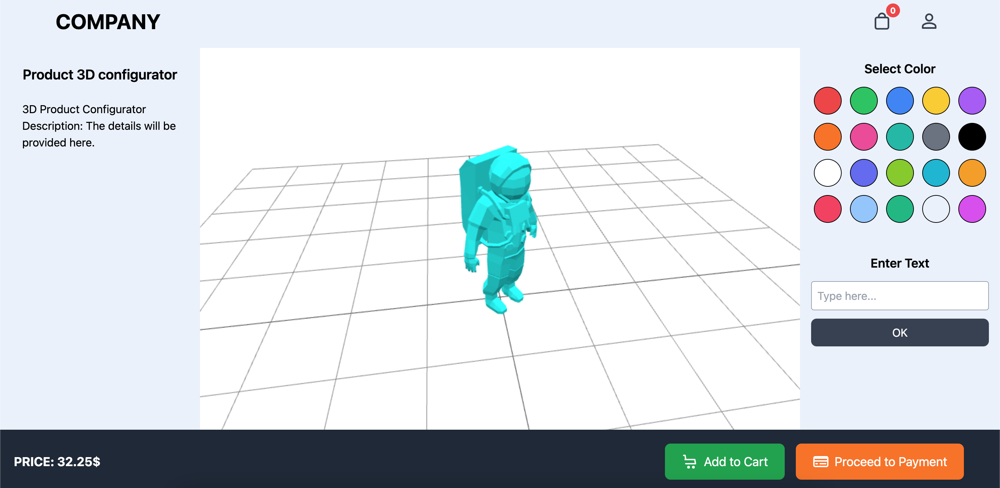

# 3D Product Configurator

## 📌 Overview

The **3D Configurator** is a web-based tool designed to allow users to **interactively customize** and **visualize** products in real-time. It is built using **Three.js** for 3D rendering, **TailwindCSS** for styling, and JavaScript for interactivity.

With the rise of **e-commerce and online shopping**, businesses are shifting towards **customized product experiences** where users can personalize items before purchasing. This project serves as a foundation for integrating **3D visualization** into **online stores** and **product showcase platforms**.

---

## 🎯 Key Features
1. **3D Product Display** 🛍️  
   - Allows customers to see the product from **all angles**.  
   - Uses **OrbitControls** for zooming and rotating.  

2. **Live Customization** 🎨  
   - Change product colors in **real-time**.  
   - Select from a **predefined color palette**.

3. **Text Personalization** 🔤  
   - Users can enter custom text and **apply it to the 3D model**.  
   - Perfect for **custom branding**, **personalized gifts**, and **name engraving**.

4. **Dynamic Lighting & Shadows** 💡  
   - Features **ambient lighting** and **directional lights** for **realistic rendering**.  
   - A **grid helper** makes the 3D space visually structured.

5. **E-commerce Ready** 🛒  
   - Integrated with **cart & checkout** buttons.  
   - Shows **live product pricing**.

6. **Fast & Responsive UI** ⚡  
   - Built with **TailwindCSS** for a modern and fluid interface.  
   - Fully **responsive** across desktop, tablets, and mobile devices.

---

## 🚀 Potential Use Cases
### 1️⃣ E-Commerce Platforms
- **Customizable products** such as T-shirts, shoes, jewelry, and furniture.  
- Customers can preview changes **before purchasing**.  

### 2️⃣ Manufacturing & Prototyping
- Companies can showcase **3D models of prototypes** to clients.  
- Adjust colors, materials, or text **before production**.

### 3️⃣ Automotive & Tech
- Car companies can let users **customize vehicle colors & accessories**.  
- Tech companies can allow **laptop/phone customizations** (e.g., engravings).

### 4️⃣ Fashion & Apparel
- Customers can **preview clothing in different colors** before buying.  
- Personalization for **logos, text, and patterns**.

### 5️⃣ Interior Design & Furniture
- Users can place **3D models of furniture in different settings**.  
- Try out **different textures and colors**.

---

## 📌 Technologies Used
| Technology   | Purpose |
|-------------|------------------------------------------------|
| **Three.js**  | 3D rendering and model handling |
| **TailwindCSS**  | Styling and UI design |
| **JavaScript** | Logic and interactivity |
| **HTML/CSS** | Structure and styling |
| **GitHub Pages** | Deployment |

---

## 📜 License
This project is **open-source** and available under the **MIT License**.

---

## 📬 Contact
For inquiries or collaborations, contact:  
📧 Email: `mkafhb@gmail.com`
